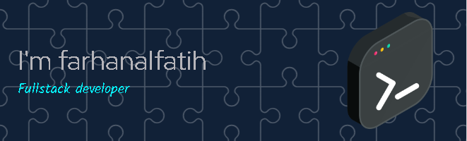

### Hello I'm farhan

I am a motivated, versatile individual who is always eager to face new challenges with an unwavering learning spirit. I am highly dedicated to delivering quality results through hard work and a strong commitment to self-development.

With good adaptability, I am ready to face various situations, work independently or in a team, and continue to grow along with changes and developments in the surrounding environment.

I believe that with an open mindset and continuous growth, I can make a meaningful contribution and help achieve common goals.

### Skills

###  Projects

### 🌐 [portfolio](https://farhanalfatih.vercel.app/)  
Deskripsi: 
Personal website showcasing profile, skills and project portfolio

Tech Stack:

### Contact Me
     
   